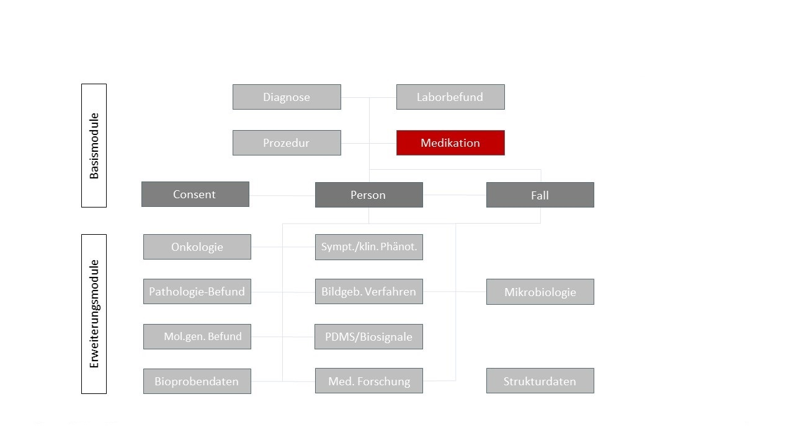
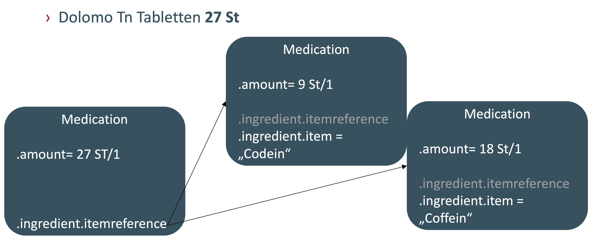

# Home - MII IG Medikation v2027.0.0-ballot.rc1

* [**Table of Contents**](toc.md)
* **Home**

## Home

| | |
| :--- | :--- |
| *Official URL*:https://www.medizininformatik-initiative.de/fhir/core/modul-medikation/ImplementationGuide/mii-ig-medikation | *Version*:2027.0.0-ballot.rc1 |
| Active as of 2026-09-02 | *Computable Name*:MII_IG_Medikation |

### Introduction

This specification describes the FHIR representation of the Core Dataset (CDS) module **Medikation** of the Medical Informatics Initiative (MII). It covers the module's use cases and the associated FHIR profiles, extensions and terminology resources in their normative form. The MII Core Dataset enables the standardized secondary use of routine clinical data for medical research.

The Medikation module carries the data elements for documenting medication orders and administrations as well as medication plans. It is one of the base modules of the MII Core Dataset.

| | |
| :--- | :--- |
| Date | 2026-02-17 |
| Version | 2027.0.0-ballot.rc1 (CalVer`YYYY.n.n`) |
| Status | active |
| Realm | DE |

### Target audience

##### Implementers

Data Integration Centers (DIC), software developers and system architects building FHIR-based solutions.
 → see [Profiles](profiles.md) and [Logical Models](logical-models.md).

##### Researchers

Scientists using KDS data for medical research.
 → see [Guidance for Researchers](researcher-guidance.md).

### Description of the Medikation module



The following types of documentation of medication processes can be distinguished, among others:

1. Medication in hospital (mainly inpatient and day-patient care)
1. Admission and discharge medication
1. Outpatient medication
1. Self-medication (over the counter)
1. Medication in the context of clinical trials
1. Medication documentation for the German national medication plan

Medication information can range from the mere documentation that a preparation was given during an encounter, all the way to a detailed structured record of individual doses with coding of active ingredient, dose form, route of administration and dose according to internationally established standards.

Five sub-modules are available for documenting medication, according to their scope:

1. **Medication**([Medication](http://hl7.org/fhir/R4/medication.html)) describes a single medication with active ingredient, dose form, strength and so on.
1. **Medication statement**([MedicationStatement](http://hl7.org/fhir/R4/medicationstatement.html)) describes medication documentation independent of an order or an administration.
1. **Medication list**([List](http://hl7.org/fhir/R4/list.html)) allows several medication statements to be grouped into one coherent list.
1. **Medication request**([MedicationRequest](http://hl7.org/fhir/R4/medicationrequest.html)) describes the ordering of a medication by clinical staff.
1. **Medication administration**([MedicationAdministration](http://hl7.org/fhir/R4/medicationadministration.html)) describes an actual administration event of a medication by clinical staff.

#### Stating the unit "package"

For medication information that demonstrably refers to whole packages via the PZN, the unit for the `Medication` instance is stated as follows:

```
"amount": {
    "numerator": {
        "value": 27,
        "unit": "Tablet",
        "system": "http://standardterms.edqm.eu",
        "code": "10219000"
    },
    "denominator": {
        "value": 1,
        "unit": "Package",
        "system": "http://unitsofmeasure.org",
        "code": "1"
    }
}

```

#### Combination packages



Combination packages can be represented straightforwardly by nesting `Medication` hierarchically, linking from `Item.reference` to other `Medication` instances. The "upper" `Medication` instance thus serves as the package hierarchy and as a container for the actual medication. It also carries the PZN of the combination package. The actual medication (the "sub-medication") is represented as a complete `Medication` instance — each without a PZN, with complete medication data including ASK and, where applicable, ATC.

#### Medication statement

For documenting medication events independent of an order or an administration — for example in medication plans, or where patients state their own medication.

A medication administration differs from a medication statement in that it carries fuller information about the administration, based on the actual administration data. A medication statement is therefore usually less specific. It does not prescribe documenting exactly when the medication was administered, only that a report of its intake exists — where information on time, amount or rate, or even the medicinal product itself, may be missing, incomplete or less precise. The information may come from the patient's memory, from a prescription, or from a medication list.

As a minimum, the active ingredient should be retrievable for a medication. At a further stage of expansion the following data elements should also be made available, depending on the source data:

* trade names of the preparations
* dose with unit of measure
* dosage regimen
* dose form
* site and route of administration

The datasets in the module are structured so that information can be given at varying levels of detail according to the source data available.

#### Medication plan

To record medication plans, several medication statements can be grouped into a list. The kind of a medication statement can be further specified by the following codes; the flags are attached both to the individual statements and to a summarising list:

* Admission medication — `IHE Deutschland Fallkontext | E210 "stationäre Aufnahme"`
* Discharge medication — `IHE Deutschland Fallkontext | E230 "stationäre Entlassung"`
* Inpatient medication — `IHE Deutschland Fallkontext | E200 "stationärer Aufenthalt"`

#### Changing the dose in a medication statement or request

To represent dose changes during treatment, a new instance of the medication statement or request with the changed dosage must be created in each case. The treatment periods stated should then follow on from one another. For a medication request, `MedicationRequest.priorPrescription` can additionally link to the preceding order.

#### Medication administration

The medication administration is used to document a single administration at event level, where a patient takes a medication or has it administered in another way — taking a tablet, or a long-running infusion, for example. It is always linked to a specific patient and may in addition be linked to a specific encounter and to the underlying medication request. This resource covers the administration of all medications except vaccines.

A minimal form of documenting medication in hospital can be achieved by inpatient care providers on the basis of codes of the German procedure classification (OPS) for medications eligible for supplementary payment. Fully structured medication documentation additionally takes place routinely in intensive care units within the patient data management system (PDMS).

### Contents

* **[Guidance](guidance.md)** — getting started and domain notes.
* **Conformance** — the KDS-wide conformance rules (requirements language, Must Support, handling missing data) are maintained centrally by the [Meta module](https://github.com/medizininformatik-initiative/kerndatensatz-meta/wiki/Conformance); the module-specific [Security and Privacy](security-and-privacy.md) considerations are part of this guide.
* **[Profiles](profiles.md)** and the further **[artifact pages](artifacts.md)** — the technical artifacts.
* **[Examples](examples.md)** — example instances.
* **[Dependencies](ImplementationGuide-mii-ig-medikation.md)** — the ImplementationGuide resource with the dependency table, cross-version analysis and copyright statements.

### Related guides

This module is part of the MII Core Dataset. It relates in particular to the modules [Person](https://simplifier.net/medizininformatikinitiative-modulperson), [Fall](https://simplifier.net/medizininformatikinitiative-modulfall), [Prozedur](https://simplifier.net/medizininformatikinitiative-modulprozeduren) and [Diagnose](https://simplifier.net/medizininformatikinitiative-moduldiagnosen) — see [Guidance for Implementers](implementer-guidance.md). Its formal dependencies are the German base profiles, the MII meta module, the IHE Germany terminology, the International Patient Summary and the [Medication IG DE](https://ig.fhir.de/igs/medication/index.html); the full list is in `sushi-config.yaml` and on the [ImplementationGuide page](ImplementationGuide-mii-ig-medikation.md).

More FHIR implementation guides can be found in the official **[FHIR IG Registry](https://fhir.org/guides/registry/)** (source: [`FHIR/ig-registry`](https://github.com/FHIR/ig-registry)).

### Imprint

This guide was created within the Medical Informatics Initiative and is subject, by its governance process, to the coordination procedure of the Interoperability Forum and the technical committees of HL7 Germany.

### Contact

* Boeker, Martin — Klinikum rechts der Isar, Technical University of Munich
* Saß, Julian — Berlin Institute of Health at Charité (BIH)
* Buckow, Karoline — TMF – Technologie- und Methodenplattform für die vernetzte medizinische Forschung e. V.

Questions about this publication can be asked on the HL7 FHIR Zulip [chat.fhir.org](https://chat.fhir.org) in the `german/mi-initiative` stream. Comments and issues are welcome as **Issues** on [GitHub](https://github.com/medizininformatik-initiative/kerndatensatzmodul-medikation/issues).

### Authors (in alphabetical order)

* Ammon, Danny — SMITH
* Bönisch, Caroline — HiGHmed
* Boeker, Martin — DIFUTURE
* Buckow, Karoline — TMF e. V.
* Deppenwiese, Noemi — MIRACUM
* Ganslandt, Thomas — MIRACUM
* Lautenbacher, Heinrich — DIFUTURE
* Löbe, Matthias — SMITH
* Räuscher, Editha — TMF e. V.
* Reith, Maximilian — KBV
* Riedel, Andrea — MIRACUM
* Saß, Julian — HiGHmed
* Schild, Stefanie — MIRACUM
* Semler, Sebastian — TMF e. V.
* Thun, Sylvia — HL7 Deutschland e. V.
* Wrobel, Susann — SMITH
* Zabka, Susanne — MIRACUM
* Zautke, Alexander — HL7 e. V.

### Copyright and License

© 2019+ TMF e. V., Charlottenstraße 42, 10117 Berlin

This work is licensed under the [Creative Commons Attribution 4.0 International License (CC BY 4.0)](https://creativecommons.org/licenses/by/4.0/).

For the usage rights of the underlying FHIR technology, see the FHIR base specification.

Some of the code systems used are published and maintained by other organizations; the copyright of the respective publishers applies.

### Disclaimer

The content of this document is public. Please note that parts of this document are based on FHIR version R4, which is copyrighted by HL7 International.

Although this publication was prepared with the greatest care, the authors cannot accept any liability for direct or indirect damage that may arise from the content of this specification.

