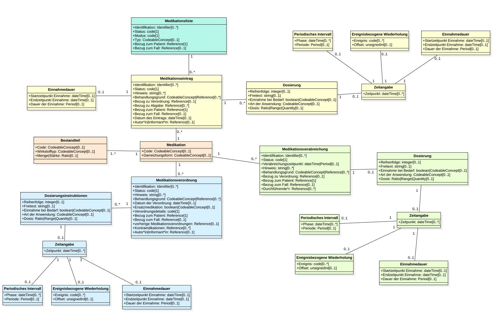

# UML Diagrams - MII IG Medikation v2026.0.1

* [**Table of Contents**](toc.md)
* [**Guidance**](guidance.md)
* **UML Diagrams**

## UML Diagrams

### UML

As a more abstract version of an information model, and to better illustrate the relations between the domain concepts, a UML class diagram was created on the basis of the ART-DECOR specifications. Concepts modelled as groups in ART-DECOR are modelled here as separate classes with association relations between them.

This logical model serves only to represent the data elements and their descriptions. The data types and cardinalities used are not to be regarded as binding — that is determined conclusively by the FHIR profiles. The assignment of FHIR elements to the ART-DECOR specification is described in the comment field in ART-DECOR.

